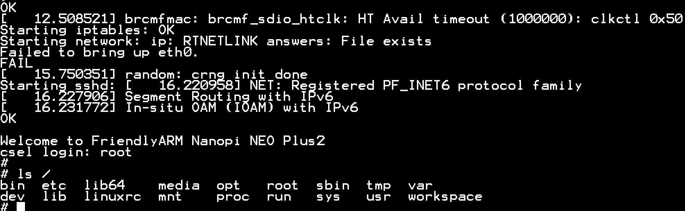
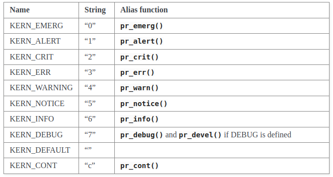

<!--
## TODO
 NO Comment
--> 

# Environnement Linux embarqué et programmation noyau Linux

# Préambule
Ce travail repose sur la théorie et les instructions données lors du cours CSEL faisant partie du cursus MES de la HES-SO. Ces informations sont disponibles sur le [site du cours](https://mse-csel.github.io/website/). Une base de code est également donnée sur le [git du cours](https://github.com/mse-csel/csel-workspace).\
Ce rapport contient un résumé de ce qui a été fait avec quelques explications et commentaires. Ce rapport repose sur le travail que nous avons réalisé se trouvant sur le [git de notre groupe](https://github.com/kirillgou/csel-workspace), en particulier dans le dossier `my_src`. Nous avons essayé de faire un code bien structuré et surtout bien commenté afin de nous faciliter la relecture du code pour avoir un bon exemple pour la réutilisation des notions traitées dans ce travail.\

# Introduction
Le but de ce travail est de mettre en place un environnement de travail pour une cible embarquée, la compréhension de différentes zones de mémoire, développement de module pour le kernel Linux, ainsi que d'application.

# 1. Environnement Linux embarqué
## Mise en place de la machine hôte
Pour mener à bien ce travail, nous avons besoin d'une machine hôte sous Linux, Windows ou OSx et des logiciels suivants: [Docker Desktop](https://www.docker.com/products/docker-desktop), [Git](https://github.com/), [Visual Studio Code](https://code.visualstudio.com/), [Balena Etcher](https://www.balena.io/etcher/)\
Nous commençons par forker le repos principal, puis le pull sur notre machine. Nous ouvrons le repos dans VSCode et acceptons de le réouvrir dans un Container (Reopen in Container). Si VSCode ne nous propose pas cette option, il faut vérifier que le module 'Dev Containers' soit bien installé.\
Une fois ouverts dans un Container, nous exécutons le scripte `get-buildroot.sh` dans le terminal de VSCode. Ce scripte nous permet de télécharger buildroot et faire la configuration nécessaire pour ce projet. [Buildroot](http://buildroot.uclibc.org/) est un outil qui nous permettra de générer une distribution Linux pour notre cible à partir de zéro. Cet outil se compose :\
1. D'une chaine de compilation croisée nous permettant de compiler pour notre cible dont l'architecture est différente de notre hôte.\
2. Image du noyau (Kernel) Linux, code source (niveau Kernel) de l'OS que nous déploierons sur la cible\
3. RootFS, le système fichier racine est le répertoire principal contenant des répertoires, logiciels de base du système et des logiciels d'applications.\
4. Bootloader, dans notre cas U-Boot qui est le premier programme à être exécuté au lancement du système. Il se chargera d'effectuer certaines vérifications, puis de démarrer le système principal sous Linux.\

## Compilation et lancement de la cible
Le noyau et le rootfs peuvent être configuré dans buildroot avec les commandes:
```sh
    cd /buildroot
    make menuconfig
```
Enfin, la compilation se fait avec les commandes:
```sh
    cd /buildroot
    make
```
Une fois que la compilation est faite, nous pouvons enlever l'ancien rootfs s'il est présent et extraire le nouveau:
```sh
    rm -Rf /rootfs/*
    tar xf /buildroot/output/images/rootfs.tar -C /rootfs
```
> Note\
> Nous pouvons aussi utiliser les scripts `/usr/local/bin/delete-rootfs.sh` et `/usr/local/bin/extract-rootfs.sh` présents dans l’image Docker.
Maintenant que nous disposons de nos images, nous devons les extraire du container vers notre machine hôte afin de graver une carte SD. Pour ce faire, nous pouvons utiliser la commande:
```sh 
    rsync -rlt --progress --delete /buildroot/output/images/ /workspace/buildroot-images


    # ou le script :
    /usr/local/bin/sync-images.sh
```
En utilisant Balena Etcher, nous flashons notre carte SD avec l'image `buildroot-images/sdcard.img`.\
En insérant la carte SD dans la cible et la démarrant, nous pouvons observer la séquence de lancement de U-Boot avec une communication série (câble série USB). Enfin, nous pourrons-nous connecté une fois le boot terminé avec le login `root` _**sans mot de passe**_


## Configuration pour la communication réseau
Notre cible a été configurée avec l'adresse 192.168.0.14. Il nous est proposé de configurer notre machine hôte avec l'adresse 192.168.0.4, afin de pouvoir communique avec cette dernière à travers le réseau.  
> Notes
>- IP :   192.168.0.4
>- Mask : 255.255.255.0
>
>- sous Windows:
>   - Mask : 24
>   - Permettre les connexions entrantes dans le firewall pour le réseau 192.168.0.0/24 

Une fois ces manipulations faites, nous pouvons tester la connexion avec un ping, puis nous connecter par ssh à la cible:
```sh
    ssh root@192.168.0.14
```

> _Note / supposition à verifier_\
> L'adresse IP de la cible est définie au moment du boot, puis au démarrage de Linux. Elle est écrite en dur, mais nous pouvons la modifier. \
> Les fichiers `/workspace/boot-scripts/boot_cifs.cmd` et `/workspace/config/board/friendlyarm/nanopi-neo-plus2/rootfs_overlay/etc/network/interfaces` contiennent les informations dont nous avons besoin. \
> Il suffira de recréer une image (sans recompiler le kernel) et de la déployer.

La commande `uname -a` nous permet de voir le système d'exploitation de la cible.

## Mise en place de l’espace de travail (workspace) sous CIFS/SMB
Cette étape nous permettra de partager notre répertoire de travail avec la cible. Ce que donnera un accès direct depuis la cible et nous évitera les transferts de fichiers.\
Pour effectuer l'attachement du workspace, nous devons disposer du dossier `/workspace` sur la cible.
```sh 
mkdir -p /workspace
# -p, --parents
#       no error if existing,\
#       make parent directories as needed
```
Pour attacher et détacher le dossier manuellement:
```sh
mount -t cifs -o vers=1.0,username=root,password=toor,port=1445,noserverino //192.168.0.4/workspace /workspace
umount /workspace
```

Il est possible d'automatiser le processus en éditant le fichier `/etc/fstab` en ajoutant la ligne:
```sh
//192.168.0.4/workspace /workspace cifs vers=1.0,username=root,password=toor,port=1445,noserverino
```
Ensuite, il est possible d'utiliser la commande `mount -a` pour effectuer tous les montages qui ont été paramétrés. Sinon le montage se fera automatiquement au démarrage de la cible.

## Génération d’applications sur la machine de développement hôte
L'exemple de Makefile ci-dessous donne les paths utiles pour la compilation croisée.
```Makefile
# Makefile toolchain part
TOOLCHAIN_PATH=/buildroot/output/host/usr/bin/
TOOLCHAIN=$(TOOLCHAIN_PATH)aarch64-linux-

# Makefile common part
CC=$(TOOLCHAIN)gcc
LD=$(TOOLCHAIN)gcc
AR=$(TOOLCHAIN)ar
CFLAGS+=-Wall -Wextra -g -c -mcpu=cortex-a53 -O0 -MD -std=gnu11
```

## Debugging de l’application sur la cible (VS-Code)
Pour plus d'[infos](https://mse-csel.github.io/website/assignments/environnement/#debugging-de-lapplication-sur-la-cible-vs-code)

## Mise en place de l’environnement pour le développement du noyau sous CIFS/SMB
Executer la [marche à suivre](https://mse-csel.github.io/website/assignments/environnement/#debugging-de-lapplication-sur-la-cible-vs-code)

## Questions
1. Comment faut-il procéder pour générer l’U-Boot ?
    
    On peut se déplacer dans le dossier `/builroot` et exécuter la commande `make` pour compiler complètement le builroot qui contient également U-Boot. `make` utilise le fichier `.config` dans lequel se trouvent toutes les informations nécessaires à la compilation.

2. Comment peut-on ajouter et générer un package supplémentaire dans le Buildroot ?

    Dans le dossier `/buildroot` nous effectuons la commande `make menuconfig`  qui ouvre une fenêtre de paramétrage de buildroot. Puis, dans `Target packages` nous pouvons donc y ajouter des packages supplémentaires. Pour la génération, il suffira de refaire un `make`.

3. Comment doit-on procéder pour modifier la configuration du noyau Linux ?

    De nouveau dans `/buildroot` avec la commande `make menuconfig`, nous sélectionnons les paramètres dans `Kernel`.    

4. Comment faut-il faire pour générer son propre rootfs ?

    Les paramètres de rootfs peuvent également être modifiés dans `make menuconfig` de `/buildroot` sous la rubrique `Filesystem images`. Puis, il faudra faire une compilation, après quoi effacer l'ancien rootfs et y extraire le nouveau :

    ```sh
    rm -Rf /rootfs/*
    tar xf /buildroot/output/images/rootfs.tar -C /rootfs
    ```

5. Comment faudrait-il procéder pour utiliser la carte eMMC en lieu et place de la carte SD ?

    Il nous faudrait transférer tout ce qui se trouve sur la carte SD dans la carte eMMC, à savoir l'U-Boot, le Kernel Linux, ainsi que les différents systèmes de fichier. Il nous faudra créer une partition par entité à mettre sur la carte eMMC.

    > Il faudra peut-être préciser au _sunxi-spl_, le booteur initial de NanoPi, l'emplacement d'U-Boot.


6. Dans le support de cours, on trouve différentes configurations de l’environnement de développement. Qu’elle serait la configuration optimale pour le développement uniquement d’applications en espace utilisateur ?

    Pour le développement d'application en espace utilisateur, nous aurons besoin d'une flexibilité au niveau de l'usrfs, car c'est à cet endroit que sera déployée l'application. De ce fait, nous pouvons déployer dès le début l'U-Boot, le kernel, ainsi que le rootfs sur la carte SD ou eMMC, afin de ne plus interagir physiquement avec notre cible. Puis, nous attacherons l'usrfs se trouvant sur la machine hôte en utilisant CIFS/SMB, ce qui nous permettrait de faire la compilation sur la machine hôte directement dans l'usrfs et de tester avec la cible en accédant au même usrfs.

# 2. Programmation Noyau
# 2.1 Modules noyaux
## Exercice 1
Le premier exercice nous propose de concevoir et générer un module noyau [out of tree](https://mse-csel.github.io/website/lecture/programmation-noyau/modules/module-gen/#generation-out-of-tree). C'est donc un module qui est à l'extérieure de l'arborescence du noyau. Cela nous permet de générer le module indépendamment du kernel, mais il ne pourra pas être linké statiquement à ce dernier. En s'inspirant de l'[example](https://mse-csel.github.io/website/lecture/programmation-noyau/modules/module/#squelette-dun-module), nous avons créé notre module qui nous dis bonjour et au revoir. Pour instancier le module il nous faut nous rendre dans le répertoire où se trouve notre module au format `*.ko` et exécuter la commande `insmod *.ko`. Pour le retirer, nous utilisons la commande `rmmod <module>`. Les affichages effectués par le module ne sont pas visibles sur le terminal dans l'espace utilisateur. Pour les visionner, nous devons utiliser la commande `dmesg`. Les commandes `lsmod` et `cat /proc/modules` nous permettent de visualiser les modules installés. 

Pour ajouter aux modules référencés, nous devons installer le module en ajoutant la commande `make install` aux Makefile de notre module. Cela ajoutera notre mode dans `/lib/modules/<kernel_version>/modules.dep`, qui référence tous les modules et leurs dépendances.
```makefile
    #besion de l'expor PATH pour faire modules_install
    MODPATH := /rootfs # production mode install:
    install:
        $(MAKE) -C $(KDIR) M=$(PWD) INSTALL_MOD_PATH=$(MODPATH) modules_install
```
Pour l'installer, nous effectuons la commande `sudo make install` sur la machine hôte. Voici les paramètres de modprobe :
```sh
Usage: modprobe [-alrqvsD] MODULE [SYMBOL=VALUE]...

        -a      Load multiple MODULEs
        -l      List (MODULE is a pattern)
        -r      Remove MODULE (stacks) or do autoclean
        -q      Quiet
        -v      Verbose
        -s      Log to syslog
        -D      Show dependencies
```


> Note.\
Le [makefile d'example](https://mse-csel.github.io/website/lecture/programmation-noyau/modules/module-gen/#generation-out-of-tree) propose d'utiliser `TOOLS := /buildroot/output/host/usr/bin/aarch64-linux-gnu-`, qui est incorrect, nous avons utilisé `TOOLS := /buildroot/output/host/usr/bin/aarch64-buildroot-linux-gnu-` afin de compiler.\
\
Il faut également ajouter `clean` pour la commande `make clean`

### Appris, remarque, feedback
Utilisation de make de façons récursive, extrêmement utile et puissant. Manipulation avec `modprobe` facilite l'installation et le retrait des modules, ainsi que la gestion des dépendances. La gestion de dépendance n'a pas encore été testée, serait un plus.

## Exercice 2
Cet exercice à pour but de [passer des paramètres au module](https://mse-csel.github.io/website/lecture/programmation-noyau/modules/parameters/) lors de son initialisation. Nous réutilisons le code de l'exercice précédent.\
Utilisation de macro [module_param](https://mse-csel.github.io/website/lecture/programmation-noyau/modules/parameters/).\ 
Code ajouté :
```c
    /*my_module.c*/
    #include <linux/moduleparam.h>  /* needed for module parameters */
    static char* name = "Module ex 2";
    module_param(name, charp, 0);
    static int elements = 1;
    module_param(elements, int, S_IRUSR | S_IWUSR | S_IRGRP | S_IWGRP);
    static int __init my_module_init(void){
        pr_info("Name: %s\telement: %d\n", name, elements);
        ...
    }
```
```sh
#passage de paramètres :
insmod mod_ex_noyau_2.ko elements=1024 name="test_1"
#chage param
vi /sys/module/mod_ex_noyau_2/parameters/elements

# avec modprobe ajouter fichier /etc/modprobe.conf et dedans:
options mod_ex_noyau_2 elements=12 name="From modprobe"
```
### Appris, remarque, feedback
Nous avons appris l'utilisation des paramètres avec les modules, donné les droits de modification des paramètres.

## Exercice 3
Trouvez la signification des 4 valeurs affichées lorsque l’on tape la commande `cat /proc/sys/kernel/printk`.
[Message logging with printk](https://www.kernel.org/doc/html/latest/core-api/printk-basics.html) nous apprend que les valeurs retournées par cette commande nous informe du _console_loglevel_ courant.
Elles correspondent au niveau courant, par défaut, minimum et du boot-time. Le niveau peut être modifié avec la commande `echo 8 > /proc/sys/kernel/printk` (8 = print all messages to the console).
La correspondance des niveaux: [Source](https://www.kernel.org/doc/html/latest/core-api/printk-basics.html)\


Le _log level_ définit l'importance du message de `printk(`_`log level`_` "Message: %s\n", arg);`. Si le niveau est supérieur au niveau courant, le message sera affiché directement dans le terminal.

> Note pas sûr d'avoir compris comment changer et surtout afficher..

> Remarque. Nous avons remarqué que le print se fait dans le terminal série et pas le ssh. Donc, fonctionne. Cependant, il faudrait voir s'il est possible de printer dans le terminal qui lance la commande pour le module.


### Appris, remarque, feedback
Pas réussi à utiliser correctement les niveaux de message dans un premier temps, mais résolu plus tard lors des exercices.

## Exercice 4
Cet exercice nous demande de faire de l'allocation dynamique de mémoire au niveau du kernel. Pour cela, nous devrons utiliser la fonction `kmalloc()`.\
Nous aurons besoin de :\
1. [l'allocation dynamique](https://mse-csel.github.io/website/lecture/programmation-noyau/modules/malloc/#allocateur-kmalloc)\
2. Traitement des strings\
3. [Gestion de liste](https://mse-csel.github.io/website/lecture/programmation-noyau/modules/bibliotheques/#exemple-de-liste-chainee)\

> Attention à bien libérer l'espace lors de l’exit

### Appris, remarque, feedback
Nous avons revu comment faire une allocation de mémoire au niveau kernel. Nous avons également appris à utiliser les listes avec la librairie list.h.

## Exercice 5: Accès aux entrées/sorties
Cet exercice nous demande de récupérer les informations se trouvant dans des registres sur notre cible. Pour ce faire, nous devons accéder à des zones précises dans la mémoire. On utilise alors le MMIO memory-mapped I/O et un remapping dans la mémoire virtuelle.

> Note\
L'utilisation de `request_mem_region` pose problème. La réservation ne se passe pas correctement. Nous avons également testé avec le code de correction fourni, et l'erreur est également présente.\
Cependant, le programme fonctionne correctement sans la réservation de mémoire.
Avec la commande `cat /proc/iomem`, nous avons pu observer que cette espace est déjà réservée par :\
    01c30000-01c3ffff : 1c30000.ethernet ethernet@1c30000

> attention les données sont en BigEndian
> Note\
Les valeurs retournées pour la température semblent cohérentes, mais ne sont pas exactement les mêmes qu'avec la commande `cat /sys/class/thermal/thermal_zone0/temp`

### Appris, remarque, feedback
Nous avons appris la réservation de mémoire, ainsi que le fait qu'elle ne bloque pas la bonne exécution de programme si elle échoue. Il faut également faire attention avec le Big et Little Endean.


## Exercice 6: Threads du noyau
Dans cet exercice, nous devons implémenté un module qui [lancera un thread](https://mse-csel.github.io/website/lecture/programmation-noyau/modules/threads/#creation-de-threads-dans-le-noyau) à son instanciation. Ce thread devra afficher un message toutes les 5 secondes. 

Nous avons utilisé les fonctions proposées dans le cours pour faire cet exercice. À noter que le paramètre `namefmt` donné lors de l'initialisation `struct task_struct* kthread_run(int (*threadfn)(void *data), data namefmt,...);` peut être retrouvé en effectuant la commande `ps -aux` qui nous liste les processes en exécution.

### Appris, remarque, feedback
Nous avons appris à lancer les threads au niveau kernel. Tout comment en C, ils peuvent récupérer des données à leurs lancements à travers des structures de données. 


## Exercice 7: Mise en sommeil
Le but de cet exercice est de synchroniser deux thread du noyau à l'aide d'events. Pour ce faire, nous aurons besoin d'une queue d'attente, qui nous permettra d'informer un thread qu'une modification a été effectuée. Une fois le thread informé, il se réveillera et effectuera une vérification sur la condition qui lui est donnée. Si la condition est remplie, il effectuera l'action qui lui est demandée. Sinon, il se remettra en sommeil.\
Dans notre cas, la condition est une valeur de variable atomique. Cette variable nous permet d'effectuer des opérations atomiques et donc nous autorise un accès concurrent.\
Le thread qui fera la notification (le réveil) incrémentera la variable atomique. Le thread qui fera l'attente (le sommeil) vérifiera la variable et la décrémentera. Si elle est positive, le thread qui attend effectuera l'action.\
Afin de partager l'information entre deux threads, nous avons deux solutions :\
1. utiliser une variable globale\
2. utiliser une variable partagée\

Nous avons opté pour les variables partagées, même si elles sont plus complexes à mettre en place, nous trouvons que c'est une solution plus propre.\
Pour partager les données entre les threads, nous avons utilisé une structure de données qui nous permet de stocker les données et de les passer en paramètre à nos fonctions.\
Nos deux fonctions fonctionnent correctement et donnent les résultats attendus. À noter qu'il ne faut pas oublier le ```\n``` à la fin de la chaine de caractère pour que le message soit affiché immédiatement, sinon cela pour porter confusion lors des observations.

### Appris, remarque, feedback
Nous avons appris à utiliser les variables atomiques, ainsi que les queues d'attente. Il était particulièrement intéressant de mettre en place une exécution concurrente avec une communication inter thread. C'est une notion que nous pensons peut être souvent utile. Nous avons également mis en place un affichage coloré que facilite la lecture des messages.
 
## Exercice 8: Interruptions
Cet exercice nous demande de créer un module qui va nous permettre de récupérer les interruptions des switchs. Pour ce faire, nous devons utiliser [les fonctions](https://mse-csel.github.io/website/lecture/programmation-noyau/modules/interruptions/#installation-des-routines-de-traitement-des-interruptions) `request_irq`, `gpio_to_irq` et `free_irq`.\
Pour la gestion des GPIO nous avons utilisé la librairie gpio.h, plus particulièrement les fonctions `gpio_is_valid` `gpio_request`, `gpio_direction_input` et `gpio_free`.\
Après initialisation, si nous appuyons sur un des boutons, le terminal nous affiche le numéro d'interruption du bouton correspondant.\

### Appris, remarque, feedback
Le numéro du GPIO à utiliser peut être retrouvé dans [le schéma](https://mse-csel.github.io/website/documentation/assets/Schematic_NanoHat_OLED_v1.4_1804.pdf).\
La commande `cat /proc/interrupts` nous permet de voir les interruptions en cours:\
```sh
    88:    31   0   0   0  sunxi_pio_edge   0 Edge   irq_k1
    90:    42   0   0   0  sunxi_pio_edge   2 Edge   irq_k2
    91:    36   0   0   0  sunxi_pio_edge   3 Edge   irq_k3
```
Attention à garder l'interruption en cours.\


# 2.2 Pilotes de périphériques
Quatre types de pilotes de périphériques sont disponibles dans le noyau Linux :\
- pilotes orientés caractère (char device driver)
- pilotes orientés bloc (block device driver)
- pilotes orientés réseau (network device driver)
- pilotes orientés mémoires (uio device driver)


## Exercice 1: Pilotes orientés mémoires
Cet exercice nous demande de créer un [pilote orienté mémoire](https://mse-csel.github.io/website/lecture/programmation-noyau/pilotes/uio-driver/). C'est le plus simple des pilotes à créer qui nous permet de mapper dans l'espace virtuel du processus les registres et zones mémoires.\
Ce mapping se fait avec la fonction `mmap` qui prend en paramètre le fichier `/dev/mem` qui offre ce service par défaut sous Linux.\
Cette méthode permet d'accéder à la mémoire uniquement depuis l'application développée, ne partageant pas cette information les autres parties du système à travers des fichiers partagés.\
Il faut faire attention avec les adresses. Nous pouvons adresser uniquement depuis de début de la page d'adresse. De ce fait nous devons savoir à quelle offset de la page se trouve notre donnée.\
Pour le faire, nous pouvons utiliser la fonction `getpagesize()` qui nous retourne la taille d'une page.\
Pour avoir l'offset de notre donnée, nous devons faire `offset = adresse % getpagesize()`.\
Puis nous pouvons obtenir l'adresse de la page avec `adresse_page = adresse - offset`.\
De plus lorsque nous voulons accéder à une donnée, nous devons faire `regs + (offset + position * 4 )/sizeof(uint32_t)` ou `regs + offset / sizeof(uint32_t) + (position)`.\

### Appris, remarque, feedback
Nous avons appris à utiliser mmap au niveau utilisateur. Nous avons rencontré des problèmes avec les adressages, que nous avons pu régler en nous aidant du code de correction fourni. De plus, il était compliqué de créer un Makefile pour compiler notre programme. Nous avons donc utilisé le Makefile fourni dans le dossier de correction. Nous pensons que ça serait une bonne idée d'avoir un petit explicatif sur les différents Makefile kernel et userspace.\

## Exercice 2: Pilotes orientés caractère
Cet exercice nous demande de créer un [pilote orienté caractère](https://mse-csel.github.io/website/lecture/programmation-noyau/pilotes/char) nous permettant de stocker et récupérer une valeur à l'aide des commandes `read` et `write`.\ 
Ce pilote est un module et donc est développé au niveau du noyau. Il va nous permettre d'interagir à travers le fichier `/dev/[char_driver]`.\
Le pilote doit comporter les fonctions `open`, `release`, `read` et `write`. Il doit aussi être enregistré avec la fonction `alloc_chrdev_region` et déregistré avec `unregister_chrdev_region` et associé à un fichier avec `cdev_init` et `cdev_add`.\
Une fois le pilote chargé, nous devons créer le fichier `/dev/[char_driver]` avec la commande `mknod /dev/[char_driver] c [MAJOR] [MINOR]`. L'affichage de ces valeurs est pratique lors de l'initialisation avec `MAJOR(dev_t)` et `MINOR(dev_t)`. Pour retirer le fichier, une fois que le module est retiré, nous pouvons utiliser la commande `rm /dev/[char_driver]`.\

### Appris, remarque, feedback
Nous nous sommes rafraichis la mémoire sur la création de pilote de type caractère et avons appris à utiliser la commande `mknod` pour rendre accessible par à travers le fichier notre pilote.\

## Exercice 3: Pilotes orientés caractère à plusieurs instances 
Dans cet exercice, nous devons reprendre le pilote de l'exercice 2 et le modifier pour que nous puissions spécifier le nombre d'instances que nous voulons créer.\
Les fonctions `static inline unsigned iminor(const struct inode *inode)` et `static inline unsigned imajor(const struct inode *inode)` permettent de récupérer le numéro major et minor du fichier qui est utilisé. De cette manière, nous pouvons savoir vers quel buffer adresser l'opération. Nous pouvons aussi retrouver cette information à partir du descripteur de fichier avec la fonction `iminor(file_inode(f))` ou `iminor(f->f_inode);` et `imajor(file_inode(f))` ou `imajor(f->f_inode)`.\
Ne pas oublier d'ajouter le paramètre avec `vi /etc/modprobe.conf ` : `options mod_ex_pilotes_3 instances=5`
Puis il faut refaire la commande `mknod /dev/[char_driver] c [MAJOR] [MINOR]` pour créer les fichiers correspondant à chaque instance minor.\

### Appris, remarque, feedback
Nous avons réutilisé les notions déjà apprises pour développer un module plus complexe. Nous avons appris à utiliser les fonctions `iminor` et `imajor` pour récupérer le numéro major et minor du fichier qui est utilisé.\

## Exercice 4: Pilotes orientés caractère accès depuis l'espace utilisateur
Cet exercice nous demande de créer une application utilisateur qui va utiliser le pilote de l'exercice 3.\
Nous avons instancié le module de l'exercice 3 avec 5 instances. Nous avons donc 5 fichiers `/dev/my_mod_ex3_0` à `/dev/my_mod_ex3_4`.\
Attention, pour lire ce qui a été écrit dans le buffer, il faut fermer et rouvrir le fichier après l'écriture.\


## Exercice 5: sysfs
Cet exercice nous demande de créer un pilote qui va créer un fichier dans le dossier `/sys/class/...`. Ceci nous permettra le lire et d'écrire dans ce fichier.\
Afin de créer un fichier dans le dossier `/sys/class/...`, nous devons utiliser la fonction `class_create`.\
Nous devons ensuite créer un fichier dans le dossier `/sys/class/...` avec la fonction `device_create`.\
Pour créer un fichier dans le dossier `/sys/class/...`, nous devons utiliser la fonction `device_create_file`.\
Avant de le créer, nous devons déclarer l'attribut de devise avec `DEVICE_ATTR` auquel nous devons passer le nom du fichier, les droits d'accès, les fonctions de lecture et d'écriture.
La lecture et l'écriture se fait à travers un buffer.\

### Appris, remarque, feedback
Nous avons appris à créer une classe du driver, ainsi que des fichiers représentant les instances du driver dans le dossier `/sys/class/...`.\

## Exercice 5.1: sysfs opérations sur les fichiers
Cet exercice nous demande de modifier le pilote de l'exercice 5 pour qu'il puisse faire des opérations sur les fichiers.\
De ce fait, nous devons regrouper les exercices précédents dans un seul pilote pour obtenir le résultat désiré.\

## Exercice 7: Opérations bloquantes
Pour cet exercice, nous devons implémenter un pilote et une application utilisateur qui utiliseront des opérations bloquantes pour transmettre une interruption provenant du matériel.\
Pour cela, nous allons au niveau du pilote une queue et une variable atomique pour faire une attente.\
L'attente peut être effectuée dans la fonction `read` en ajoutant les lignes suivantes au début de la fonction:
```c
    wait_event_interruptible(my_queue, atomic_read(&request_can_be_processed)>0);
    atomic_dec(&request_can_be_processed);
```
Mais cela affectera toutes les lectures obligeant d'attendre une interruption pour pouvoir lire. Nous pouvons également permettre l'attente dans la fonction `poll`:
```c
    unsigned int mask = 0;
    poll_wait(file, &my_queue, wait);
    if(atomic_read(&request_can_be_processed) > 0){
        atomic_dec(&request_can_be_processed);
        mask |= POLLIN | POLLRDNORM; // read operation
        // mask |= POLLOUT | POLLWRNORM; // write operation
    }    
    return mask;
```
Cette méthode permet de faire une lecture en tout temps des données sauvegardées dans le driver. Ou de faire une attente pour une interruption en utilisant la fonction `poll` du côté utilisateur.\
Pour utiliser la fonction `poll` de l'utilisateur, nous devons ajouter le header `poll.h` et utiliser la fonction `poll` avec les paramètres suivants:
```c
    #include <sys/poll.h>
    struct pollfd fds;
    fds.fd = fd;
    fds.events = POLLIN;
    fds.revents = 0;

    printf("polling...\n");
    poll(&fds, 1, -1);
    printf("polling done, can read\n");
```

### Appris, remarque, feedback
Nous avons appris à utiliser les opérations bloquantes pour faire une attente sur une interruption provenant du matériel en utilisant la fonction `poll`.\
Dans cet exercice, nous avons aussi implémenté la création de device afin de facilité l'utilisation du pilote.\
Notre module compte le nombre d'appuis sur chaque bouton et permet de les lire à tout moment ou de patienter pour une interruption, si tous les autres appuie ont déjà été validé.\
Nous avons trouvé cet exercice fort intéressant, car il a permis d'interfacé la partie matérielle avec la partie user space de Linux à travers un pilote.\


## Ajout personnel
Nous avons rajouté un script de lancement pour savoir plus facilement quand notre cible est prête pour que nous puissions nous y connecter en ssh. 
```sh
    # in /etc/init.d/S90kirillEasy 
    #!/bin/sh
    cd /sys/class/gpio/
    echo 10 > export 
    echo out > gpio10/direction 
    echo 1 > gpio10/value
```

## Conclusion
Nous avons trouvé ce travail fort instructif et intéressant. Par moment c'était assez long pour aller jusqu'au bout de la matière en creusant plus loin dans les explications et les documentations, mais ça en valait toujours la peine. Un point fort positif était de disposé d'un code de correction, qui permettait de trouver une direction à prendre pour résoudre les problèmes dans les moments de blocage.\
Nous avons également trouvé que les exercices donnés étaient bien adaptés et assez ouverts ce qui nous a permis à plusieurs reprises s'amuser un peut avec le code pour faire des tests et bien comprendre le fonctionnement interne de Linux.\

PS: Nous vous rendons uniquement les exercices obligatoires, car nous avons manqué de temps pour faire les exercices optionnels. Cependant, nous comptons les faire dans les prochains jours, car nous trouvons qu'ils peuvent nous apporter beaucoup de connaissances supplémentaires.\
